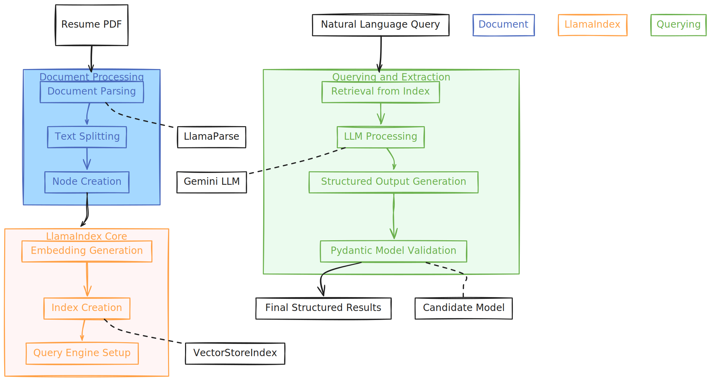

# Resume Insights



Resume Insights is an advanced resume parsing and analysis tool that leverages the power of LlamaIndex, Gemini, and Streamlit to extract key information from PDF resumes and present it in an intuitive, interactive format.

## 🌟 Features

- **PDF Resume Parsing**: Seamlessly extract information from PDF resumes.
- **AI-Powered Analysis**: Utilizes Gemini LLM for intelligent information extraction.
- **Interactive UI**: Built with Streamlit for a user-friendly experience.
- **Skill Visualization**: Displays top skills with interactive progress bars.
- **Structured Output**: Extracts name, email, age, and skills in a structured format.

## 🚀 Quick Start

1. Clone the repository:
   ```
   git clone https://github.com/luillyfe/resume-insights.git
   cd resume-insights
   ```

2. Install dependencies:
   ```
   pip install -r requirements.txt
   ```

3. Set up environment variables:
   ```
   export GOOGLE_API_KEY=your_google_api_key
   export LLAMA_CLOUD_API_KEY=your_llama_cloud_api_key
   ```

4. Run the Streamlit app:
   ```
   streamlit run app.py
   ```

5. Open your browser and navigate to `http://localhost:8501`.

## 🛠️ Tech Stack

- **LlamaIndex**: For document processing and indexing.
- **Gemini**: AI model for natural language understanding and generation.
- **Streamlit**: For building the interactive web application.
- **Pydantic**: For data validation and settings management.
- **LlamaParse**: For efficient PDF parsing.

## 📊 How It Works

1. **Document Processing**: Resumes are parsed using LlamaParse and split into manageable chunks.
2. **Indexing**: Processed documents are indexed using LlamaIndex's VectorStoreIndex.
3. **Querying**: Natural language queries are processed to extract relevant information.
4. **Structured Output**: Results are validated against a Pydantic model for consistency.
5. **Visualization**: Extracted information is presented through an intuitive Streamlit interface.

## 🤝 Contributing

Contributions are welcome! Please feel free to submit a Pull Request.

## 📝 License

This project is licensed under the MIT License - see the [LICENSE](LICENSE) file for details.

## 📬 Contact

For any queries or suggestions, please open an issue or contact [luillyfe89@gmail.com](mailto:luillyfe89@gmail.com).

---

Made with ❤️ by []